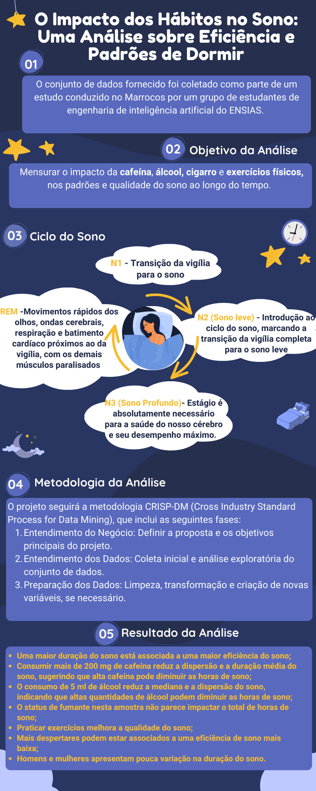

    

# Análise da Eficiência e Padrões de Sono: Um Estudo Baseado em Dados sobre Fatores que Afetam a Qualidade do Sono

## Resumo

    Esse conjunto de dados <a href="https://www.kaggle.com/datasets/equilibriumm/sleep-efficiency">Sleep Efficience</a>, disponível no site do Kaggle, registra variáveis detalhadas sobre o sono de participantes, incluindo duração total, eficiência (proporção do tempo dormindo), e distribuição entre sono REM, profundo e leve. Ele também monitora fatores comportamentais como consumo de cafeína e álcool, tabagismo e frequência de exercícios, fornecendo uma base para análises sobre a influência desses fatores na qualidade do sono.

## Gráfico Abstrato

    

## Justificativa do Projeto

    A eficiência do sono desempenha um papel fundamental na saúde física e mental dos indivíduos. Compreender os fatores que influenciam a qualidade do sono é essencial para profissionais de saúde, pesquisadores e para o público em geral. A partir da análise dos dados, busca-se identificar correlações entre a eficiência do sono e variáveis como horas de sono, consumo de álcool, tabagismo e níveis de atividade física.

## Metodologia

O projeto seguirá a metodologia **CRISP-DM** (Cross Industry Standard Process for Data Mining), que inclui as seguintes fases:

1. **Entendimento do Negócio**: Definir a proposta e os objetivos principais do projeto.
2. **Entendimento dos Dados**: Coleta inicial e análise exploratória do conjunto de dados.
3. **Preparação dos Dados**: Limpeza, transformação e criação de novas variáveis, se necessário.

## Desenvolvedores
 - [Lousane Avelar](https://github.com/lousaneavelar)
 - [Halane Moreira](https://github.com/HalaneMoreira)
 - [Maria Isabel Oliveira](https://github.com/isabe1l-t)
   
